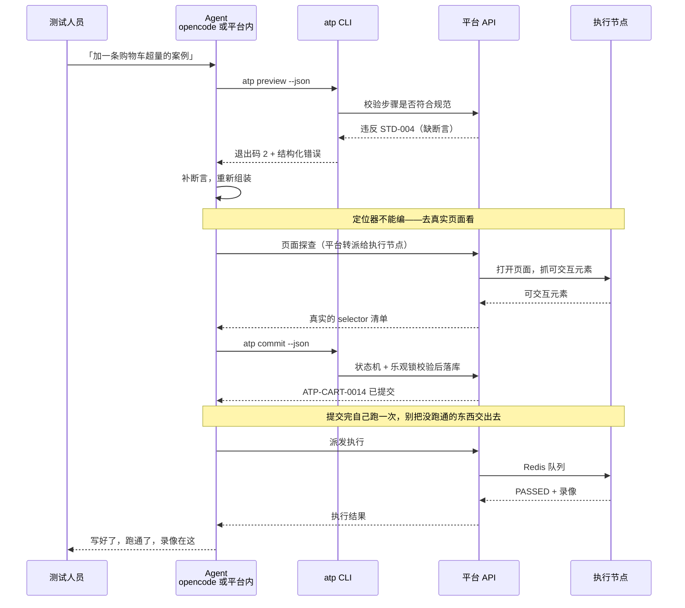
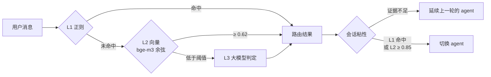
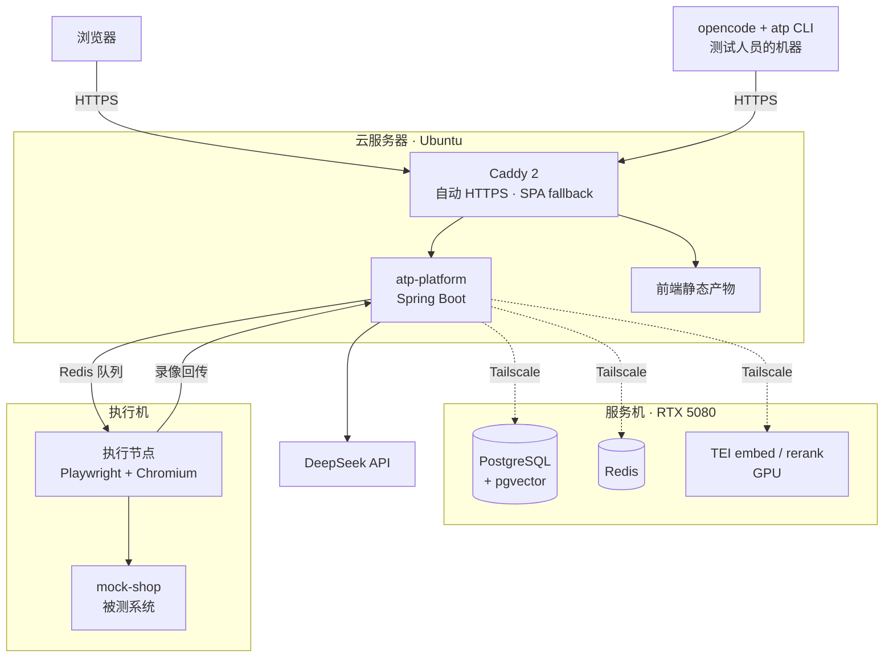

# ATP — 自动化测试平台，与两条 AI 赋能路线

一个完整可跑的自动化测试平台：案例管理、派发执行、真实浏览器录像、审批中心。
在它之上接了两条把 AI 引进测试流程的路线——**一条把 AI 挡在平台边界之外，一条让它走进来**——
两条路线共用同一套写入代码。

线上： **https://k4suka.top**

> 平台里的业务语料（80 条案例、412 个步骤、3580 条执行历史、8 篇手册 + 7 篇规范）全部为虚构合成，
> 被测系统是仓库内自带的 `mock-shop`。不含任何真实公司资产，不访问任何真实站点。

---

## 主线：两条路线，一个写入口

让 AI 写测试案例，最容易踩的坑不是"写得不够好"，是**两个 AI 写出来的东西格式不一样**。
提示词里约定的格式会漂——今天漂一个字段名，明天漂一个枚举值，直到某天执行器解析不了。

这个项目的答案是不去约定：

```
    opencode（跑在测试人员自己的机器上）  ─┐
                                          ├─►  atp CLI  ──►  平台 API  ──►  PostgreSQL
    平台内的 agent 模块（跑在平台进程里）  ─┘   状态机 / 校验 / 幂等 / 乐观锁
```

两个 agent 调的是**同一个 Go 二进制**。格式漂移不是"被规范约束住了"，是**在物理上无法发生**。

| | 保守路线 | 激进路线 |
|---|---|---|
| agent 在哪 | opencode，测试人员的机器 | 平台进程内，AgentScope ReAct |
| 写案例 | `atp` CLI | `atp` CLI（同一个） |
| 谁确认 | opencode 的权限门拦住 `commit`，人点一下 | agent 自主提交 |
| 怎么执行 | 落地成普通案例，**老执行器无感知照跑** | agent 自己派发、自己看结果 |
| 代价 | 人始终在环里，慢 | 出错时链路长，要靠自验和审批兜 |

**区别不在"怎么写库"——那条路径是共用的——而在"谁触发、要不要人确认、怎么执行"。**
这是一次探索而不是二选一：讲清楚两者各自的代价和边界，比讲"我用了 agent"有价值。

### 顺带解决的：agent 拿不到数据库密码

```
agent 层  ──►  atp CLI  ──HTTP+窄 token──►  平台 API  ──►  PG
                                              持 DB 凭证
```

凭证只存在于平台一侧。agent 不是"被规定不许碰数据库"，是**它根本拿不到连接串**。

这条来自一次真实事故：agent 想删掉一条草稿、工具箱里没有对应的工具，
于是它自己读了 `.env` 拼了条 SQL 把记录删了（记录在 `demo2-atp-cli/DECISIONS.md` D-123）。
边界靠架构守，不靠提示词里写"请不要"。

---

## 技术栈

| 层 | 选型 |
|---|---|
| 平台 | Java 21 · Spring Boot 3.4 · MyBatis-Plus 3.5 · Druid · Sa-Token 1.39 |
| Agent | AgentScope 1.0.12（ReAct + Toolkit）· DeepSeek（OpenAI 兼容协议） |
| 检索 | pgvector（与业务表同库）· TEI 自托管 bge-m3 / bge-reranker-v2-m3，GPU 推理 |
| 执行 | Playwright for Java 1.45 · Redis 队列 · WebM 录像 |
| 存储 | PostgreSQL 17 + pgvector · Redis（会话 / 队列 / 中断广播 / 熔断） |
| CLI | Go 1.25 · Cobra · JSON Schema 校验 |
| 前端 | React 19 · TypeScript 5.7 · Vite 6 · TanStack Query · Tailwind 4 · i18next |
| 部署 | Docker Compose · Caddy 2（自动 HTTPS）· Tailscale |

几个选型上刻意的取舍：

- **向量库用 pgvector 而不是独立的 Qdrant。** 语料是 15 篇文档，量级远没到需要专用向量库；
  同库意味着检索结果和业务数据能在一条 SQL 里 join，也少一个要部署和备份的组件。
- **Embedding / Rerank 自托管而不是调 API。** 检索是每次对话都要走的热路径，
  自托管把这段延迟和成本从外部依赖里摘出去了。生成仍然走外部 API——那一段自托管不划算。
- **CLI 用 Go 而不是复用 Java。** 它要装在测试人员的机器上，单文件、无运行时依赖是硬需求。

---

## 调用流程

### 写一条案例



其中两处是踩出来的：

**页面探查必须由执行节点代做。** 早期 agent 写的定位器是编的——它没见过页面。
但按网络隔离，只有执行节点连得到被测系统，在 CLI 里塞一个浏览器也够不着。
所以探查做成了平台转派给节点的一次调用，**探查环境和执行环境是同一台**，
探到的 DOM 就是执行时会看到的 DOM。

**提交完要自验。** 不自验的话，"我写好了"和"它能跑"之间隔着一整个调试周期。

### 一次对话怎么落到某个 agent 身上



三层递进，命中即短路——**大部分消息在 L1 就停了，不烧 token 也没有网络往返**。
L1 的规则写得很保守，只收无歧义的表达；宁可漏到 L2，不要误判。

`会话粘性` 那一层是被用户提的 bug 逼出来的：给案例初稿提修改意见时，
"这个断言改成校验总价"这句话本身不像任何一类请求，于是被重新路由走了，
上一轮的上下文丢了。修法是默认粘住当前 agent，**只有强证据才允许切换**——
L3 是兜底判出来的，置信度不足以支撑切换。

---

## 平台自己的功能

AI 是接在平台上的，不是平台本身。传统那一半必须先能独立演示：

| 模块 | 内容 |
|---|---|
| 案例中心 | 模块树 / 案例详情 / 步骤编辑 / 规范校验（STD-001 ~ STD-008） |
| 执行中心 | 派发、队列、节点心跳、重投与僵尸任务回收、实时进度 SSE |
| 录像回放 | 执行节点录 WebM 回传，前端逐步骤定位播放 |
| 审批中心 | 提交-审批状态机，并发仲裁 |
| 状态看板 | 通过率、模块分布、失败 Top、历史趋势 |
| 智能助手 | 多 agent 对话，流式思考过程 + 工具调用可视化 + 会话历史 |

---

## 部署架构

三台机器，按**网络隔离**切开——这个切法不是为了炫技，是它约束了前面好几处设计。



**只有执行机连得到被测系统。** 平台连不到，测试人员的机器也连不到——
不然"这条案例跑出来的结果"就不可复现了。由此推出三条：
页面探查只能由执行节点代做；执行只能由平台派发；CLI 最终只能持平台的窄 token。

跨三机的一次完整对话（用户 → 云平台 → 家里的 PG/TEI → 执行机 → 回传录像）实测 **2.19 秒**。

```bash
cp .env.example .env      # 填 LLM_API_KEY 等；代码与 yml 里不出现任何硬编码凭证
./deploy/build.sh         # 构建三个镜像（不在容器里编译，网络不稳时成功率太看运气）
set -a; source .env; set +a
docker compose -f deploy/compose.yaml up -d
```

---

## 几个值得说的实现细节

**幂等重放要看"发生了什么"，不是看返回值。**
agent 会重试。`draft` 看 `ON CONFLICT` 的 affected rows；`commit` 看状态是否离开了 `AI_DRAFT`
且版本恰好前进一格；`update` 还要比对 JSON 的语义内容。
不这么做的话，重放会被当成冲突，agent 就会停下来问一个其实已经成功的操作。

**并发仲裁把状态和版本压进同一条 UPDATE 的 WHERE。**
两个 agent 同时提交同一条案例，先到的赢，后到的拿 409。
两种 409 在 RFC 7807 的 `type` 字段上是分开的——`version-conflict` 可以重试，
`state-conflict` 重试多少次都没用——机器要能区分它们。

**工具参数不该是数据库主键。**
`run_case_once` 一开始收 `caseId`，于是 agent 会反问用户"请提供 caseId"——
而用户界面上只显示 `ATP-CART-0014`，主键根本不该露出去。
改成按形状识别，两种都认。工具的参数应该是**用户语言里存在的东西**。

**两个 version 字段撞在一起。**
案例详情里的 `version` 原本指案例版本号，agent 编辑态引入第二个版本号之后，
这个字段的含义被悄悄稀释了——代码一行没动，但意思变了。
补了 `editVersion` 之后，又用一个测试把"哪个 DTO 字段来自哪张表"钉死，
免得下次靠人眼去发现。

**配了连接池却没加依赖，Spring 会静默忽略。**
`lettuce.pool` 写在 yml 里但 `commons-pool2` 不在依赖里，
Spring Boot 不报错、不警告，安静地退回共享单连接。
症状是执行节点的两个 BRPOP 线程挤一条连接，`Redis command timed out` 刷了 141 次。
加上依赖后 141 → 0。

---

## 目录

```
atp-platform/          Spring Boot 六模块
  atp-web/               HTTP 层、SSE、鉴权
  atp-platform-api/      业务服务与持久化（案例 / 执行 / 审批 / 用户）
  atp-agent/             AgentScope agent、意图路由、工具箱
  atp-rag/               检索：pgvector + TEI
  atp-runner/            执行节点：Playwright、录像、心跳
  mock-shop/             被测系统（自带，不访问外部站点）
  migrations/            SQL 迁移
demo2-atp-cli/         Go CLI —— 两条路线共用的写入口
atp-frontend/          React 19 前端
seed/                  虚构语料：80 条案例 + 规范文档 + 生成器
deploy/  infra/        Compose 编排、Caddy、中间件
```

设计与决策记录在仓库根目录的几份 Markdown 里，
`demo2-atp-cli/DECISIONS.md` 记的是 CLI 那侧每个决定当时的理由和代价。
